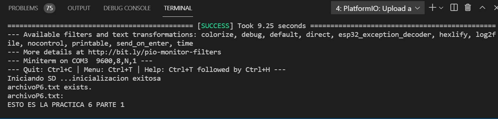
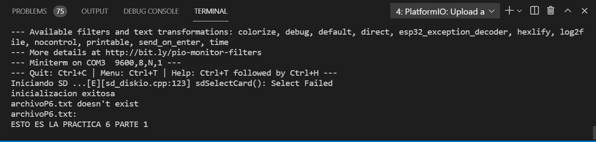

# PRACTICA 6  
### PARTE 1:
Siguiendo la programacion que se nos proporciona para realizar la practica lo primero que nos encontramos es la declaracion de un objeto de tipos myFile para lo que posteriormente usar sus funciones.
Seguidamente nos encontramos con el set up con un seguido de comandos empezando como siempre con el serial.begin a la misma velocidad que el monitor_speed que se encuentra en el .ini, segidamente se declara el SPI ya que estos por libreria se declaran los pines de la forma denominada HSPI mientras que la que nosotros usaremos sera la VSPI,posteriormente se hace un print hacia la terminal/monitor indicando que se inicia la SD despues de todas las declaraciones necesarias se ejcutara una sentencia if con la condicion que si no detecta ninguna tarjeta SD en el componente este devulva un print por terminal/monitor informandonos que no se pudo iniciar y por tanto se acabe el programa en ese instante, si no se cumple esta condicion, es decir si que se detecta una SD en el componente, se nos informara a traves de otro print que se a iniciado con exito y a continuacion pasara hacer una de las dos sentenecias if o else. La sentencia if se ejecutara si se cumple la condicion de que en esta SD que se encuentra en el componente en ella hay un fichero denominado archivo de formato .txt si es asi ejecutara un print hacia la terminal/monitor mostrando que si que se encuentra este archivo buscado y a continuacion abrira este archivo mediante el comando myFile=SD.open("/archivo.txt") una vez abierto si se cumple la condicion que se puede abrir correctamente se ejecutara el seguidos que hay en el primer if, el cual hace que se nos muestre todo el contenido por terminal/monitor del archivo, primero se nos mostrara archivo.txt: y en las siguientes linias a traves del while con condicion de que hasta que no leea todo el contenido de este archivo no pare de mostrar el texto de lo que se encuentra en el a traves de esos comandos, por otra banda si detecta el archivo pero no es capaz de abirlo se ejecutara las comandas que contiene el else posterior al if el qual nos mostrara a traves de un print que sea producido un error al abrir dicho archivo. Por otra parte si no existe ningun archivo.txt en la tarjeta se ejecutara el seguido de comandos que se encuentra en el else posterior al conjunto total del if explicado anteriormente, este se encuentra en la linia 38 del programa, este else se compone primero por impimirnos en la terminal/monitor que dicho archivo no existe para posteriormente con el comando myFile = SD.open("/archivo.txt", FILE_WRITE); lo que hacemos es crar un archivo en la tarjeta SD denominado archivo.txt para posteriormente con los comandos myFile.println("Hola mundo"); myFile.close();  escribir en este archivo la frase Hola mundo y cerrarlo por tal de salvarlo, seguidamente ejecutamos el mismo conjunto de comandos utilizados en el primer caso si se detectaba este archivo en la SD ya creado por tal de imprimir por terminal/monitor todo lo que contiene este.
Es decir lo que obtenemos finalmente en el terminal/monitor ya haga una o la otra dependiendo un menaje o otro para finalmente mostrarnos el contenido de un archivo.
En el caso de que el archivo no exista i se nos detecte la SD: 

En el caso de que el archivo si exista i se nos detecte la SD: 

